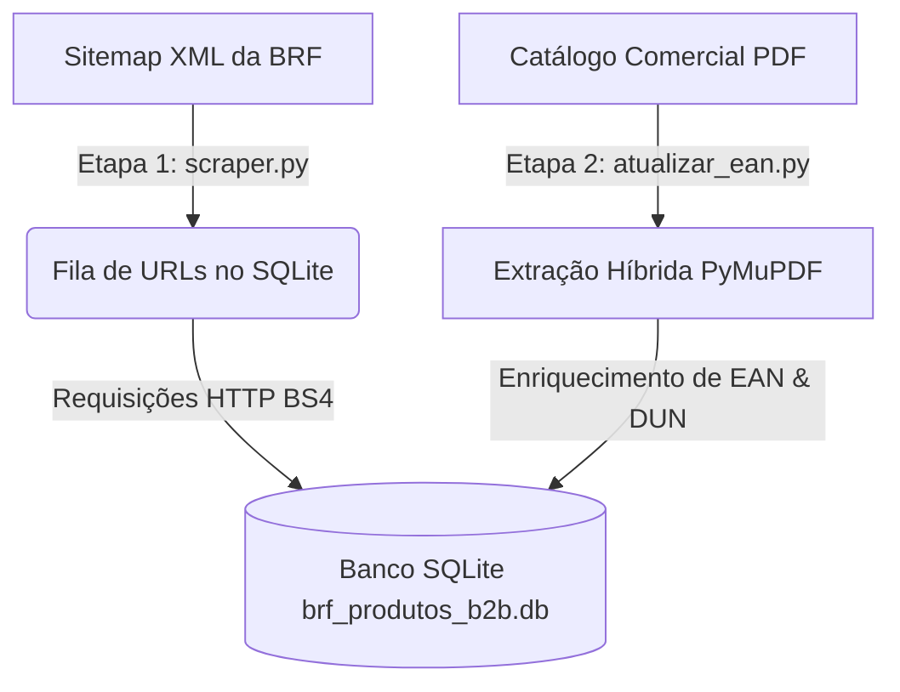

# BRF B2B - Pipeline Completo de Dados (Web Scraping & ETL PDF) 🚀

Este repositório contém uma solução de engenharia de dados em duas etapas projetada para extrair, transformar e unificar o catálogo de produtos comerciais da BRF (marcas Sadia, Perdigão, Qualy, Deline, etc.).

A solução foi projetada e otimizada sob **arquitetura de recursos limitados**, visando uma execução fluida e resiliente a falhas de rede em ambientes móveis como **Termux ou Ubuntu sobre Android (mobile)**.

---

## 📐 Visão Geral do Pipeline de Dados

O fluxo é integrado em cima de um único banco de dados local SQLite e está dividido em duas etapas complementares:



---

## 🛠️ Detalhes das Etapas

### 🔹 Etapa 1: Web Scraping do Portal (`scraper.py`)
Esta etapa é responsável pela colheita inicial dos dados dos produtos diretamente do portal oficial B2B da BRF.
* **Fila de Execução com Resume State:** Lê o sitemap XML (`centralmbrf.com.br/sitemap-product-1.xml`) e cria uma fila de URLs no banco SQLite. Se o script cair (por falta de bateria ou rede), ao ser reiniciado ele **retoma exatamente de onde parou**, evitando requisições duplicadas.
* **Resiliência a Quedas de Rede (Wait & Retry):** Implementa um sistema persistente que detecta perda de sinal de internet, aguarda o reestabelecimento e tenta novamente sem abortar a execução.
* **Parsing com BeautifulSoup & Regras Heurísticas:** Faz o parse do HTML estruturado extraindo pesos, temperaturas, marcas, e infere de forma lógica e heurística a classe/categoria do produto e suas condições de conservação com base em palavras-chave.
* **Banco Unificado SQLite:** Grava as informações iniciais, criando o esqueleto dos registros contendo o SKU como chave primária.

---

### 🔹 Etapa 2: ETL e Enriquecimento do Catálogo PDF (`atualizar_ean.py`)
Muitas vezes, os portais web não exibem códigos de barras logísticos específicos. Esta etapa lê o catálogo comercial em PDF da BRF para enriquecer os registros existentes na base com códigos de barras **EAN-13** (consumidor) e **DUN-14** (caixas/distribuição).
* **Leitura Otimizada (PyMuPDF):** Processamento leve e rápido ideal para Termux. As páginas são abertas individualmente sob demanda, e o coletor de lixo do Python (`gc.collect()`) é invocado no encerramento de cada página para liberar RAM.
* **Extração Híbrida Inteligente:** Tenta realizar o parse utilizando o extrator de tabelas estruturadas do PyMuPDF (completamente imune a descolamento de texto corrido em layouts de grid). Caso a página não possua tabelas detectáveis, recorre a uma máquina de estados linear baseada em Regex no texto corrido.
* **Minimização de I/O em Disco:** Consulta o banco de dados e apenas efetua a gravação de `UPDATE` se os campos de destino no SQLite estiverem vazios (`ean IS NULL OR ean = ''` / `dun IS NULL OR dun = ''`), poupando hardware móvel.
* **Validação Estrita:** Ignora desvios de digitação do catálogo (EANs e DUNs devem conter apenas dígitos e possuir exatamente 13 e 14 caracteres respectivamente para serem homologados).

---

## 🗄️ Estrutura do Banco de Dados SQLite

Ambas as etapas escrevem no banco de dados SQLite `brf_produtos_b2b.db` na tabela `produtos`:

```sql
CREATE TABLE produtos (
    sku TEXT PRIMARY KEY,
    title TEXT,
    descrFiscal TEXT,
    ean TEXT,       -- Código EAN-13 (Consumidor)
    dun TEXT,       -- Código DUN-14 (Distribuição/Caixa)
    marca TEXT,
    classe TEXT,
    conservacao TEXT,
    tempMin TEXT,
    tempMax TEXT,
    pesoLiquido TEXT,
    pesoBruto TEXT,
    vidaUtil TEXT,
    url TEXT
);
```

---

## 🚀 Como Configurar e Executar

### 1. Instalar as Dependências no Ubuntu/Termux
```bash
apt-get update && apt-get install -y python3-pip python3-fitz
pip3 install beautifulsoup4 requests
```

### 2. Estrutura de Arquivos Recomendada
```text
~/scraping/brf-dun/
├── scraper.py               # Script da Etapa 1 (Web Scraping)
├── atualizar_ean.py         # Script da Etapa 2 (ETL do PDF)
├── catalogo_brf.pdf         # Catálogo comercial PDF da BRF
└── brf_produtos_b2b.db      # Banco de dados SQLite unificado
```

### 3. Rodar a Etapa 1 (Web Scraping)
Para popular a base de dados SQLite inicial do zero:
```bash
python3 scraper.py
```

### 4. Rodar a Etapa 2 (ETL / Enriquecimento)
Para ler o arquivo PDF e preencher os dados ausentes de EAN e DUN de forma segura:
```bash
python3 atualizar_ean.py
```

---

## 🛠️ Contribuição e Licença

Desenvolvido para pipeline de engenharia de dados estruturados B2B.

* **Desenvolvedor:** NaejBarbosa
* **Licença:** MIT
